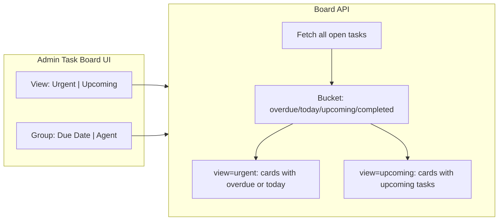

# Add Upcoming Tasks View to Admin Task Board

## Current Behavior

The board API (`[src/app/api/admin/tasks/board/route.ts](src/app/api/admin/tasks/board/route.ts)`) fetches all open/completed tasks, buckets them into `overdue | today | upcoming | completed`, then **filters to only return referral cards with urgent tasks** (lines 221 and 245):

```220:245:src/app/api/admin/tasks/board/route.ts
  if (groupBy === 'agent') {
    const visibleCards = referralCards.filter(hasUrgentTasks);
    // ...
  }
  const visibleCards = referralCards.filter(hasUrgentTasks).sort(...)
```

The `[AdminTaskBoard](src/components/admin/admin-task-board.tsx)` component has a `groupBy` toggle (`due` | `agent`). Inside each `[ReferralTaskCard](src/components/admin/referral-task-card.tsx)`, upcoming tasks are collapsed behind a chevron toggle.

## Changes

### 1. API Route - Add `view` query parameter

**File:** `[src/app/api/admin/tasks/board/route.ts](src/app/api/admin/tasks/board/route.ts)`

- Accept a new `view` search param: `'urgent'` (default) or `'upcoming'`
- `**view=urgent`** (current behavior): filter to cards with overdue or today tasks, sort by earliest urgent due
- `**view=upcoming`**: filter to cards that have at least one upcoming task, sort by earliest upcoming due date
- Add a `getEarliestUpcomingDue` helper analogous to `getEarliestUrgentDue`
- Apply the same view filter in both the `groupBy=agent` and `groupBy=due` code paths

### 2. Board Component - Add view toggle

**File:** `[src/components/admin/admin-task-board.tsx](src/components/admin/admin-task-board.tsx)`

- Add a `view` state: `'urgent' | 'upcoming'`
- Render a second row of toggle buttons (or a segmented control) for "Urgent" / "Upcoming"
- Pass `view` in the SWR URL: `/api/admin/tasks/board?groupBy=${groupBy}&view=${view}`
- Pass `view` as a prop to each `ReferralTaskCard`
- Update empty-state message: "No referrals with upcoming tasks" when `view=upcoming`

### 3. Referral Task Card - Adjust display for upcoming view

**File:** `[src/components/admin/referral-task-card.tsx](src/components/admin/referral-task-card.tsx)`

- Accept a new `view` prop: `'urgent' | 'upcoming'`
- When `view='upcoming'`: show upcoming tasks directly in the main list (not collapsed), and collapse overdue/today tasks instead (if any exist on that card)
- When `view='urgent'`: keep current behavior (overdue/today shown prominently, upcoming collapsed)




